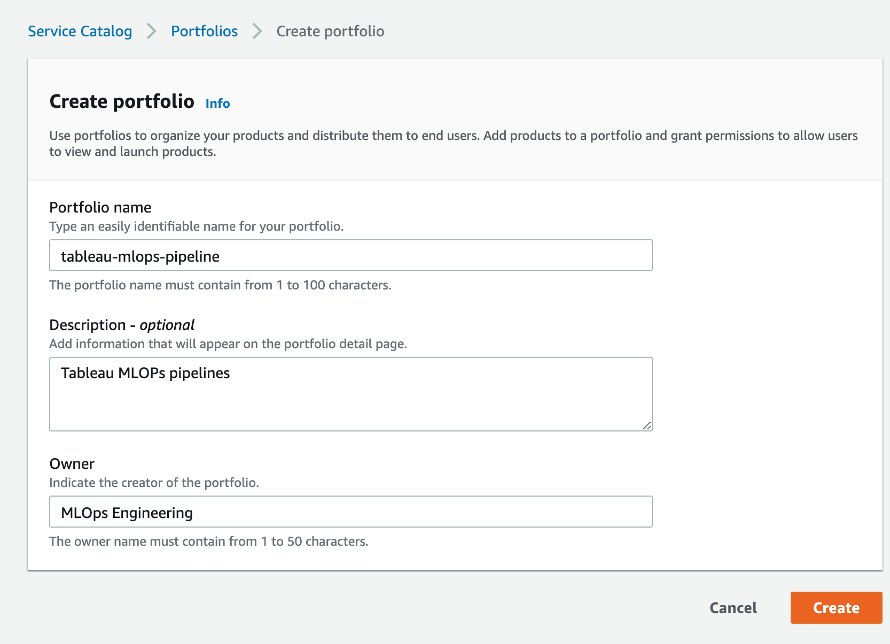
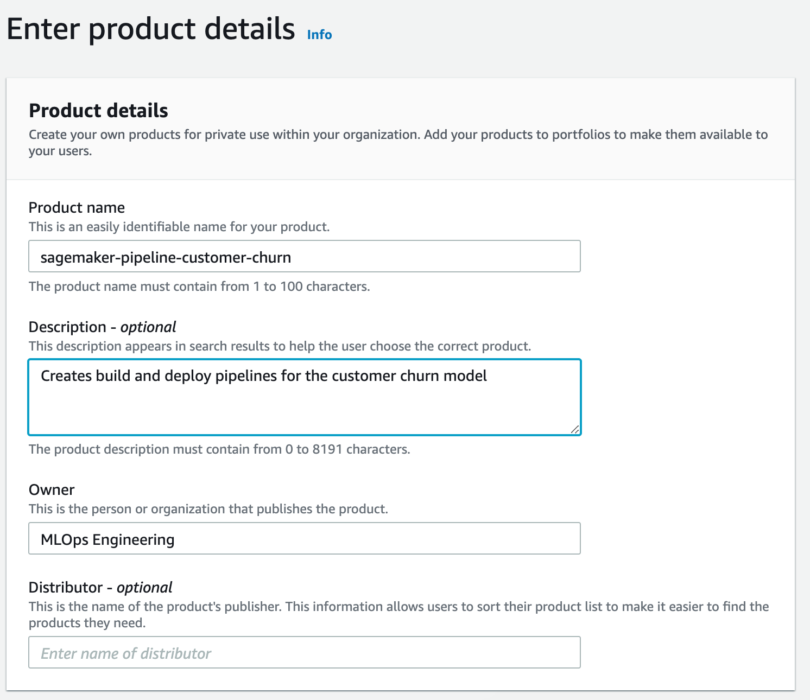
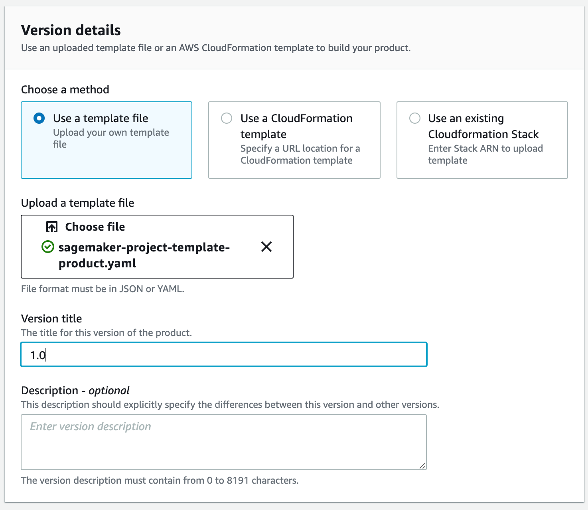
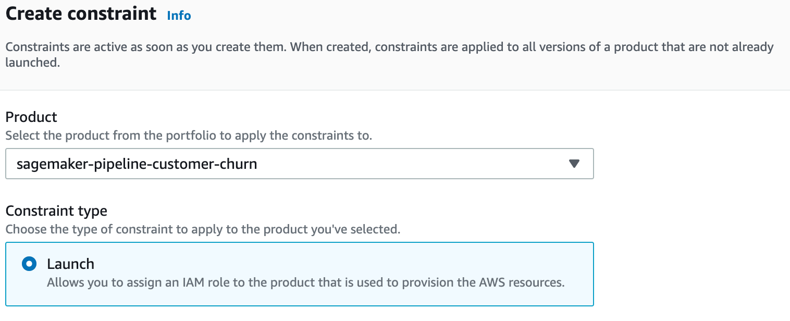
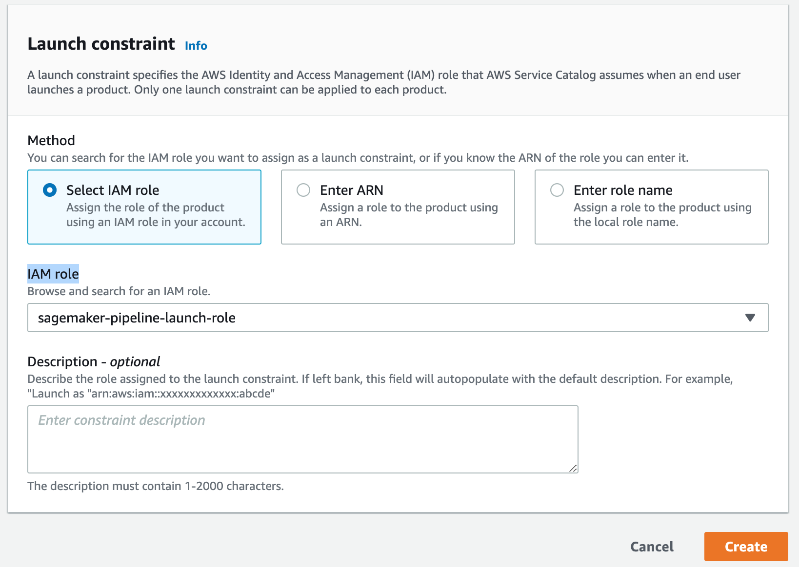
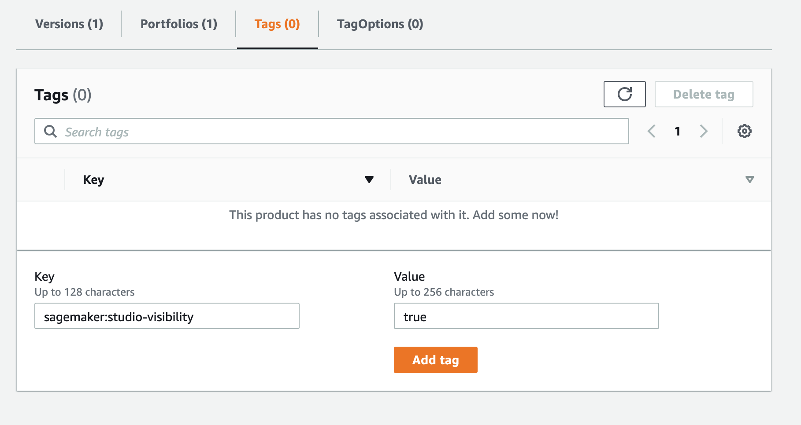
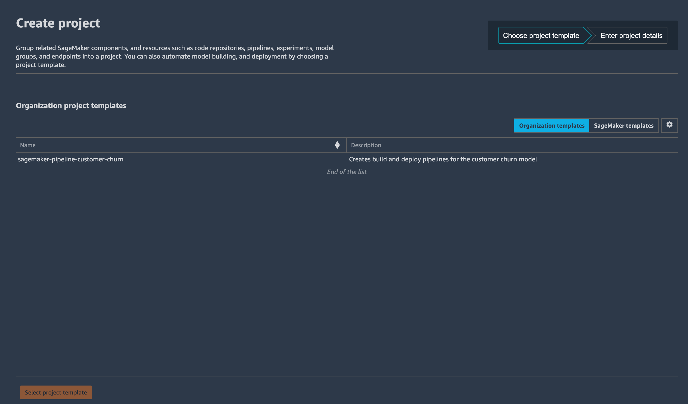
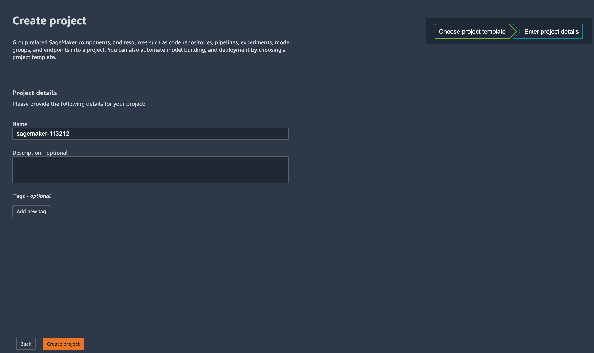
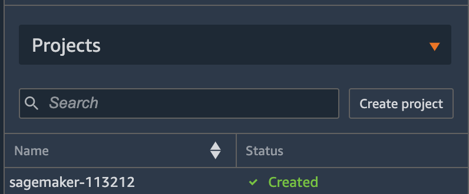
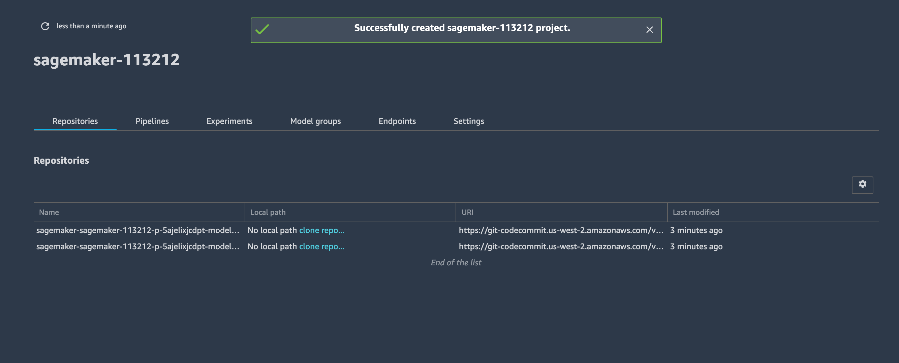

# Create Custom SageMaker Project Template 

In this lab, we will create a custom SageMaker project template using the AWS Service Catalog.

To create a custom project template, complete the following steps.

### <b>Step 1: Create an AWS Service Catalog Portfolio</b>

To create a portfolio, click on the "Portfolios" link on the AWS Service Catalog console. Provide the requested details as follows and click "Create"



### <b>Step 2: Create an AWS Service Catalog Product</b>

To create a product, click on the portfolio name, In the portfolio details page, click on "Upload new product"

Provide the product details



In the version details section, choose the "Use a template file" method and upload the template file ```sagemaker-project-template-product.yaml``` file from the ```service-catalog``` folder. Fill in a Version title and click "Review". In the Review product details page, click "Create product"



Click on "Add product to portfolio", select the product and click on "Add Proudct to Portfolio"

### <b>Step 3: Add a Launch Constraint to Assign an IAM Role</b>

Open the IAM console, In the navigation pane, choose Policies. Choose Create policy and do the following:

On the Create policy page, choose the JSON tab

Copy the content from the ```sagemaker-project-template-launch-policy.json``` file in the service-catalog folder and paste it in Policy Document, replacing the placeholder JSON in the text field:

Choose Review policy

For Policy Name, type "sagemaker-pipeline-template-launch-policy"

Choose Create policy

Next, we will create a role with this policy. In the navigation pane, choose Roles. Choose Create role and do the following:

For Select role type of trusted entity, choose AWS service select the Service Catalog use case and then choose Next: Permissions

Search for the sagemaker-pipeline-template-launch-policyselect the checkbox

Choose Next: Tags, and then Next: Review

For Role name, type sagemaker-pipeline-template-launch-role

Choose Create role

Open the AWS Service Catalog console, choose the created portfolio

On the portfolio details page, choose the Constraints tab, and then choose Create constraint

Select the product, and for the Constraint type, choose Launch. For Launch constraint, select IAM Role and click Continue



In the Launch constraint section, select Method as Select IAM Role. In the IAM role dropdown, choose sagemaker-pipeline-template-launch-role, and then click Create



To make your project template available in your Organization templates list in SageMaker Studio, create a tag with the following key and value to the Service Catalog Product you created: 
key - sagemaker:studio-visibility
value - true

For this, click on Products, click on the product name. In the tags tab, enter key and value and click on the Add tag button.



Next, Grant access to the Service Catalog Portfolio that you created to your SageMaker Studio execution role. Use either the SageMaker Studio domain execution role or a user role that has SageMaker Studio access

To provide access to the portfolio:

On the portfolio details page, choose the Groups, roles, and users tab.

Choose Add groups, roles, users.
On the Roles tab, search for the "AmazonSageMaker-ExecutionRole" used by either the Studio domain or the user role for studio user. 

Open SageMaker Studio IDE, select "SageMaker Components and registries" icon on the left navigation menu. Select "Projects" from the dropdown and click "Create project". 

On the "Create project" screen, select organization templates  

Choose the "sagemaker-pipeline-customer-churn" template amd click "Select project template"



Provide the details of the project and click "Create project"



Pipeline project resources are now created using a cloud formation template. You can verify the cloud formation deployment using AWS Cloud Formation console. Once the deployment is successful, you can see the project status as "Created"



In the "Repositories" tab, click on "clone repo" under "Local path". This will allow you to the clone both the model build and model deployment code repositories in the studio IDE.



In order for the pipeline execution to be successful, we will need to provide the correct location of the data by updating the "default_value" of the input_data ParameterString inside the ``` pipelines/customer_churn/pipeline.py``` file. This will kick of a new pipeline run. 


